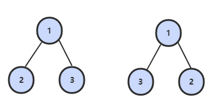

# 题目描述

请完成一个函数，输入一颗二叉树，请函数输出它的镜像。



# 解题思路

其实就是递归二叉树然后交换左右子树。

# 题解

```java
class Solution {
        public TreeNode mirrorTree(TreeNode root) {
            if (root == null) {
                return null;
            }

            if (root.left != null || root.right != null) {
                TreeNode tmp = root.left;
                root.left = root.right;
                root.right = tmp;
                mirrorTree(root.left);
                mirrorTree(root.right);
            }

            return root;
        }
    }
```
