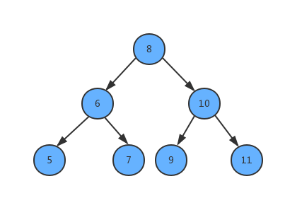

# 题目描述

输入一个整数数组，判断该数组是不是某二叉搜索树的后序遍历结构。如果是则返回true，否则返回false。假设输入数组的任意两个两个数组都互不相同，例如输入数组 {5，7，6，9，11，10，8} ，则返回true，因为这个整数序列是下图二叉搜索树的后序遍历结果。如果输入的数组是 {7，4，6，5}，由于没有哪颗二叉搜索树的后序遍历结果是这个序列，因此返回false。



# 解题思路

根据搜索二叉树后序遍历的特点，最后一个数字就是根节点的值，前面的比根节点小的数字是左节点的值，后面的比根节点大的数字是右节点的值。有了这个规律之后**递归**就行了。不满足规律就不是原二叉树。

# 题解

```java
class Solution {
    public boolean verifyPostorder(int[] postorder) {
        return recur(postorder, 0, postorder.length - 1);
    }
    boolean recur(int[] postorder, int i, int j) {
        if(i >= j) return true;
        int p = i;
        while(postorder[p] < postorder[j]) p++;
        int m = p;
        while(postorder[p] > postorder[j]) p++;
        return p == j && recur(postorder, i, m - 1) && recur(postorder, m, j - 1);
    }
}

```
