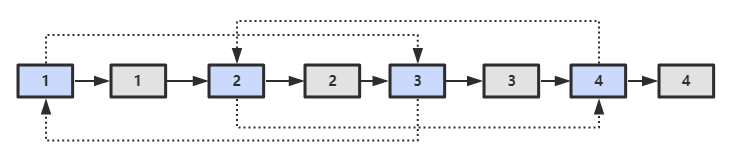

# 题目描述

输入一个复杂链表（每个节点中有节点值，以及两个指针，一个指向下一个节点，另一个特殊指针指向任意一个节点），返回结果为复制后复杂链表的head。（注意，请不要返回参数中的节点引用） 复制链表如下图：


# 解题思路

1. 在每个节点的后面插入复制的节点，如下图：
   
2. 对复制的节点的random指针进行赋值，如下图：
   
3. 将上面的链表拆成两个链表，原始链表和复制链表，如下图：
   

# 题解

```java
class Solution {
        public Node copyRandomList(Node head) {

            if (head == null) {
                return null;
            }

            Node cur = head;

            // 1. 插入一样的新节点
            while (cur != null) {  // 注意各个while的条件
                Node clone = new Node(cur.val);
                clone.next = cur.next;
                cur.next = clone;
                cur = clone.next;
            }

            // 2.设置复制节点的random指针
            cur = head;
            while (cur != null) {
                Node clone = cur.next;
                if (cur.random != null) {
                    clone.random = cur.random.next;
                }
                cur = clone.next;
            }

            // 3. 拆分链表成原始链表和复制链表
            cur = head;
            Node cloneHead = head.next;
            while (cur.next != null) {
                Node clone = cur.next;
                cur.next = clone.next;
                cur = clone;
            }

            return cloneHead;
        }
    }
```
