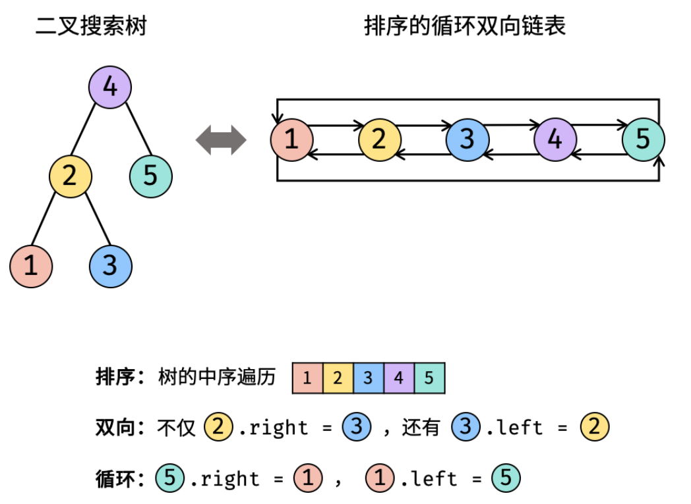

# 题目描述

输入一颗二叉搜索树，将该二叉搜索树转换成一个排序的双向链表。要求不能创建任何新的节点，只能调整树中的指针的指向，如下图：


# 解题思路

首先一定要想到用中序遍历二叉树。

将二叉搜索树 转换成一个 “排序的循环双向链表” ，其中包含三个要素：

1. **排序链表：** 节点应从小到大排序，因此应使用 **中序遍历** “从小到大”访问树的节点。
2. **双向链表：** 在构建相邻节点的引用关系时，设前驱节点 `pre` 和当前节点 `cur` ，不仅应构建 `pre.right = cur` ，也应构建 `cur.left = pre` 。
3. **循环链表：** 设链表头节点 `head` 和尾节点 `tail` ，则应构建 `head.left = tail` 和 `tail.right = head` 。



# 题解

```java
class Solution {
        Node pre, head;
        public Node treeToDoublyList(Node root) {
            if (root == null) {
                return null;
            }
            // 中序遍历，构造链表结构
            dfs(root);
            // 循环链表
            head.left = pre;
            pre.right = head;
            return head;
        }

        private void dfs(Node cur) {
            // 终止条件为中序遍历最后一个叶子结点为空
            if (cur == null) {
                return;
            }
            dfs(cur.left);
            if (pre != null) {
                pre.right = cur;
            } else {
                head = cur;
            }
            cur.left = pre;
            pre = cur;
            dfs(cur.right);

        }
    }
```
